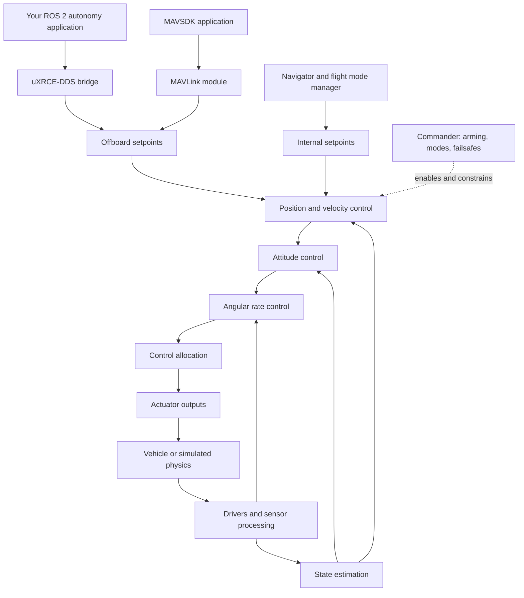

# PX4 exploration plan: autonomous behavior with ROS 2

This plan treats PX4 as a collection of modules with explicit inputs, outputs, and responsibilities. The goal is to understand enough of the flight stack to build, diagnose, and extend autonomous behavior from a companion application.

Prepared on 28 September 2026. The configured source checkout is `/home/crl/PX4-Autopilot`, branch `release/1.15`, revision `v1.15.4-4-g85df8c2281`. The `PX4-Autopilot` directory inside this workspace contains model assets and is not the complete source tree used by the current launcher. Use the v1.15 documentation alongside this checkout; newer documentation may describe different messages, parameters, or behavior.

Start with ROS 2 because the existing project uses it. Study MAVSDK later as another external interface. All flight exercises below are intended for SITL (software in the loop). This document is a study plan; its flight exercises have not been run as part of preparing it.

## The architecture to keep in mind



This is the common multicopter position/velocity control path, not every PX4 connection. Other control modes enter at different levels. uORB carries internal messages between modules; parameters, logging, and scheduling support the whole graph. Commander supervises more of the system than the single illustrated connection.

“Independent module” means a separately understandable responsibility and interface. It does not mean a module can fly a vehicle by itself. Modules depend on message freshness, valid estimates, configuration, and compatible control modes. Some run as tasks and others share work queues. See the [PX4 architecture guide](https://docs.px4.io/v1.15/en/concept/architecture).

## How to study each unit

Use a 60–90 minute session: learn the purpose, inspect the interface, observe one example, then write your explanation. Larger units need several sessions. Before reading a long implementation, inspect its message definitions and subscriptions/publications in the header.

For every unit, produce a one-page module card:

- Responsibility: what question does it answer?
- Inputs: message names, coordinate frames, units, timestamps, and validity conditions.
- Outputs: what it publishes and who consumes them.
- Execution: what causes an update, and how freshness is checked.
- Configuration: the two or three parameters relevant to your experiment.
- Failure: what happens when input becomes invalid or disappears.
- Evidence: a source location, observed message, plot, or log supporting your explanation.

The order below is the learning order. It starts with observation and system behavior, then opens the flight stack, then connects your autonomy application.

## 1. System boundaries and simulation — 1–2 sessions

**Question:** Which program is responsible for each part of a simulated flight?

Separate PX4 (flight software), the flight controller (hardware), Gazebo (physics and simulated sensors), QGroundControl (ground station), ROS 2 (robotics application framework), and your own application. A camera bridge and the PX4 flight bridge have different jobs.

**Inputs → outputs:** simulated actuator commands → physical motion → simulated sensor measurements. These measurements close the PX4 control loop.

**Read:** [project launcher](/home/crl/Desktop/Shubh/kamikaze/run_baseline.sh), [project configuration](/home/crl/Desktop/Shubh/kamikaze/drone_ws/src/drone_follow/config/follow.yaml), [PX4 Gazebo bridge](/home/crl/PX4-Autopilot/src/modules/simulation/gz_bridge), and [simulation guide](https://docs.px4.io/v1.15/en/simulation/).

**Exercise:** Draw your running system with process names and arrows. Identify which path carries images, which carries PX4 telemetry, and which carries actuator commands. Start with the project's observation mode before any flight exercise.

**Checkpoint:** Explain why seeing a drone move in Gazebo does not, by itself, identify which controller moved it.

## 2. Startup, configuration, and parameters — 1–2 sessions

**Question:** How does PX4 become a particular vehicle?

Study the distinction between build-time module inclusion, startup scripts, airframe defaults, and saved runtime parameters. Parameters configure existing behavior; they are not flight commands.

**Inputs → outputs:** selected build/airframe and saved settings → running modules with configured behavior.

**Read:** [SITL startup script](/home/crl/PX4-Autopilot/ROMFS/px4fmu_common/init.d-posix/rcS), [airframe scripts](/home/crl/PX4-Autopilot/ROMFS/px4fmu_common/init.d-posix/airframes), [parameter implementation](/home/crl/PX4-Autopilot/src/lib/parameters).

**Exercise:** Trace the selected airframe through startup. Record the meanings and current values of `MPC_XY_VEL_MAX`, `COM_OF_LOSS_T`, and `COM_OBL_RC_ACT`; make no changes initially. Distinguish defaults from overrides in your launcher.

**Checkpoint:** Explain why changing a ROS YAML file, a PX4 parameter, and a C++ controller function are three different kinds of changes.

## 3. uORB and message contracts — 2 sessions

**Question:** How do internal modules exchange information?

Learn publish/subscribe, topic instances, timestamps, update rates, and the difference between a measurement, an estimate, a setpoint, and a command. uORB is internal to PX4; DDS and MAVLink provide external communication paths.

**Inputs → outputs:** typed publications → subscribers receiving updates.

**Read:** [uORB implementation](/home/crl/PX4-Autopilot/platforms/common/uORB), [message definitions](/home/crl/PX4-Autopilot/msg), and [uORB guide](https://docs.px4.io/v1.15/en/middleware/uorb).

**Exercise:** In a PX4 SITL shell, use `uorb top` and `listener vehicle_local_position 1`. Compare `vehicle_local_position`, `trajectory_setpoint`, and `vehicle_status`. Read the matching `.msg` files and identify units and validity flags.

**Checkpoint:** Trace one topic from a publisher to a subscriber using a source search. Explain why a published setpoint is not proof that PX4 executed it.

## 4. Commander, arming, modes, and failsafes — 2 sessions

**Question:** Is the vehicle allowed to act on this request?

Study arming state, navigation state, estimator requirements, health checks, and the difference between requesting a transition and observing that transition. Learn the configured response to Offboard loss before writing an autonomous flight loop.

**Inputs → outputs:** commands plus system health/status → accepted or rejected transitions, control-mode flags, and failsafe actions.

**Read:** [Commander.cpp](/home/crl/PX4-Autopilot/src/modules/commander/Commander.cpp), [land detector](/home/crl/PX4-Autopilot/src/modules/land_detector), and [Offboard requirements](https://docs.px4.io/v1.15/en/flight_modes/offboard).

**Exercise:** Observe `vehicle_status` and `vehicle_control_mode` during a controlled SITL takeoff/land exercise. Explain a rejected request from its acknowledgement and health information. Do not bypass the check to make the exercise pass.

**Checkpoint:** Distinguish “connected,” “has a valid estimate,” “armed,” and “in Offboard.”

## 5. Sensors and state estimation — 2–3 sessions

**Question:** What does PX4 believe the vehicle is doing?

Study IMU, GNSS, barometer, and magnetometer roles; calibration, filtering, and sensor selection; then the EKF's estimated attitude, position, velocity, and biases. Start with input/output behavior before deriving the filter equations.

**Inputs → outputs:** sensor observations → processed sensor streams → estimated state and estimator health. Angular-rate feedback also comes through the processed gyro path.

**Read:** [sensor processing](/home/crl/PX4-Autopilot/src/modules/sensors), [EKF2.cpp](/home/crl/PX4-Autopilot/src/modules/ekf2/EKF2.cpp), and the `VehicleLocalPosition`, `VehicleAttitude`, and `VehicleOdometry` message definitions.

**Exercise:** Observe position, velocity, and validity flags while stationary, then during a short simulated movement. Compare simulated truth with the estimate only after aligning coordinate frames, origins, and clocks.

**Checkpoint:** Explain why a connected GNSS sensor does not automatically imply that position control is ready.

## 6. Position and velocity control — 2–3 sessions

**Question:** How does “move here” become a tilt and thrust request?

Study the nested position and velocity loops in `mc_pos_control`. Read setpoint selection, feed-forward terms, limits, and acceleration-to-attitude/thrust conversion before tuning gains.

**Inputs → outputs:** `trajectory_setpoint` plus estimated local state → `vehicle_attitude_setpoint` with thrust information.

**Read:** [MulticopterPositionControl.hpp](/home/crl/PX4-Autopilot/src/modules/mc_pos_control/MulticopterPositionControl.hpp), [control implementation](/home/crl/PX4-Autopilot/src/modules/mc_pos_control/PositionControl), [TrajectorySetpoint.msg](/home/crl/PX4-Autopilot/msg/TrajectorySetpoint.msg), and [controller diagrams](https://docs.px4.io/v1.15/en/flight_stack/controller_diagrams).

**Exercise:** Compare a short position command with a short velocity command in SITL. Plot requested and actual motion. Explain why position fields are `NaN` for velocity-only control, and why commanding zero velocity is not the same as holding a specified position.

**Checkpoint:** Predict the qualitative tilt and thrust change needed to start, stop, and climb.

## 7. Attitude and angular-rate control — 2 sessions

**Question:** How does the vehicle reach and maintain the requested orientation?

Study `mc_att_control` and `mc_rate_control` separately. Attitude is orientation; angular rate describes how quickly orientation changes. Learn quaternion meaning, body axes, feedback, saturation, and integral action at a conceptual level.

**Inputs → outputs:** attitude target plus attitude estimate → rate target; rate target plus processed gyro feedback → torque and thrust setpoints.

**Read:** [attitude controller](/home/crl/PX4-Autopilot/src/modules/mc_att_control), [rate controller](/home/crl/PX4-Autopilot/src/modules/mc_rate_control), and the controller diagrams from Unit 6.

**Exercise:** Inspect attitude and rate setpoints during the same flight recorded in Unit 6. Trace the output publications in both module headers.

**Checkpoint:** Explain why a ROS velocity controller can leave these inner loops running inside PX4.

## 8. Control allocation and actuator outputs — 1–2 sessions

**Question:** How do torque and thrust requests become individual motor commands?

Study vehicle geometry, actuator effectiveness, motor ordering, saturation, and output drivers. Allocation computes actuator demands; an output backend delivers them to hardware or simulation.

**Inputs → outputs:** `vehicle_torque_setpoint` and `vehicle_thrust_setpoint` → motor/servo commands → physical or simulated actuation.

**Read:** [control allocator](/home/crl/PX4-Autopilot/src/modules/control_allocator), [simulation output and bridge modules](/home/crl/PX4-Autopilot/src/modules/simulation), and [control allocation guide](https://docs.px4.io/v1.15/en/concept/control_allocation).

**Exercise:** Identify the simulated vehicle's rotor positions and directions; explain how a yaw request changes opposing rotor groups. Inspect `actuator_motors` during a recorded hover.

**Checkpoint:** Distinguish an attitude setpoint, a torque setpoint, a normalized motor command, and a physical rotor speed.

## 9. Navigator and flight mode manager — 1–2 sessions

**Question:** Who decides where the vehicle should go?

Study built-in Mission, Return, Hold, Takeoff, and Land behavior. Navigator and flight mode manager have different responsibilities, and the setpoint-generation path depends on the active mode. A ROS Offboard application is another source of desired motion; it does not become the onboard mission engine.

**Inputs → outputs:** mission items, mode, home position, and state → mode-specific navigation and trajectory setpoints.

**Read:** [navigator](/home/crl/PX4-Autopilot/src/modules/navigator/navigator_main.cpp) and [flight mode manager](/home/crl/PX4-Autopilot/src/modules/flight_mode_manager/FlightModeManager.cpp).

**Exercise:** Draw the difference between uploading a mission for PX4 to execute and continuously providing external Offboard setpoints. Trace one built-in mode through source and status messages.

**Checkpoint:** Choose which approach fits a fixed waypoint survey and which fits a behavior driven by live perception, with reasons.

## 10. ROS 2 integration and the MAVSDK alternative — 3–4 sessions

**Question:** How does my application communicate its intent to PX4?

For this checkout, learn the path: ROS 2 node ↔ DDS agent ↔ PX4 `uxrce_dds_client` ↔ selected uORB topics. The bridge exports selected messages, not every uORB topic. Match `px4_msgs` definitions to the firmware; inspect QoS and topic namespaces when discovery works but data does not arrive. See the [ROS 2 guide](https://docs.px4.io/v1.15/en/ros2/user_guide).

**Inputs → outputs:** external typed messages → internal PX4 setpoints/commands; PX4 state → application telemetry.

**Read:** [DDS topic mapping](/home/crl/PX4-Autopilot/src/modules/uxrce_dds_client/dds_topics.yaml), [local message package](/home/crl/Desktop/Shubh/kamikaze/drone_ws/src/px4_msgs), and [existing ROS adapter](/home/crl/Desktop/Shubh/kamikaze/drone_ws/src/drone_follow/drone_follow/follower.py).

**Exercise sequence:** subscribe to telemetry; identify the vehicle namespace; observe command acknowledgements; implement a small position-hold exercise; then test a short, bounded velocity command. Use only one component as the active setpoint writer for a vehicle.

**Conventions to master:** local NED versus ROS ENU, body FRD versus FLU, radians versus degrees, timestamps versus receipt time, and unset fields versus zero commands. For aligned world origins, ENU `(east, north, up)` becomes NED `(north, east, -up)`; attitude and body-frame transformations require their own conversions. The direct DDS bridge does not automatically reinterpret frames for you.

**Offboard contract:** PX4 requires a proof-of-life stream above 2 Hz, present for more than a second before entering Offboard, and continued while in that mode. With ROS 2, `OffboardControlMode` carries that heartbeat separately from the desired setpoint. Use a comfortable margin such as 10–20 Hz for initial labs. Set a deliberate response to stale perception even if the heartbeat remains alive. See [Offboard mode](https://docs.px4.io/v1.15/en/flight_modes/offboard).

**MAVSDK comparison:** study it as an SDK over MAVLink for telemetry, actions, missions, and supported Offboard setpoints. ROS 2 fits your existing node/perception pipeline; MAVSDK is worth trying for a smaller standalone application. Reimplement one simple flight behavior later and compare the API, telemetry, and failure handling. Do not assume ROS 2 and MAVSDK use identical messages or units.

**Checkpoint:** Trace your application's velocity vector to `mc_pos_control`, and identify who handles arming, acknowledgement, heartbeat, and stale input.

## 11. Logging and diagnosis — 2 sessions

**Question:** What evidence explains a failed or unexpected flight?

Study PX4 ULog, ROS logs/recordings, controller tracking error, estimator validity, mode transitions, and command acknowledgement. Begin collecting basic evidence from Unit 1; use this unit for deeper analysis.

**Inputs → outputs:** runtime state and events → records suitable for reconstructing what happened.

**Read:** [PX4 logger](/home/crl/PX4-Autopilot/src/modules/logger/logger.cpp) and [existing experiment guide](/home/crl/Desktop/Shubh/kamikaze/drone_ws/src/drone_follow/README.md). The project README describes `--record` for richer experiment records; check actual output files after each run.

**Exercise:** Explain one successful and one failed SITL run from a timeline: requested behavior → setpoint → mode/health → estimated response → outcome. If an internal topic is absent from ROS, use PX4 inspection/logging instead of assuming it is not published internally.

**Checkpoint:** Distinguish a wrong command, a rejected mode request, a stale input, a poor estimate, and poor controller tracking.

## 12. Build a small autonomous behavior — 3–5 sessions

**Question:** Can I combine the interfaces into a behavior that handles success and failure explicitly?

Create a single-vehicle SITL application with states such as `WAIT_FOR_HEALTH → PRESTREAM → REQUEST_OFFBOARD → ARM → TAKEOFF → EXECUTE → LAND → COMPLETE`. Check acknowledgements and observed state, and allow timeouts or rejection to leave the happy path. The exact arming/takeoff sequence must match your chosen mode and example.

**Exercise:** Take off, hold a position, fly a small square, then land. Add cancellation, stale-telemetry handling, and deliberate Offboard-stream loss as separate experiments. Record the configured failsafe and verify the resulting mode rather than assuming it landed. Add perception only after the deterministic path works.

**Deliverable:** an application, state diagram, module cards, version/configuration record, and one annotated successful run plus one failure experiment.

**Checkpoint:** Explain the complete route from application decision to motor output and back to your application, including the observed response when a dependency fails.

## Optional firmware study after the autonomy path

Read [px4_simple_app](/home/crl/PX4-Autopilot/src/examples/px4_simple_app) and [work_item](/home/crl/PX4-Autopilot/src/examples/work_item). In a separate development checkout, build a module that subscribes to an existing estimate and publishes a diagnostic result. Learn CMake/Kconfig registration, startup integration, parameter updates, work queues, and build/test targets. Begin with an observer before replacing a controller.

Defer detailed EKF derivations, board bring-up, bootloaders, device-driver implementation, fixed-wing/VTOL controllers, and custom control allocation until your project needs them.

## Suggested pace and first session

Allow roughly 22–31 sessions, spread across 5–8 weeks at a comfortable pace. Progress depends on the checkpoints, not the calendar. Linux shell, basic Python or C++, ROS 2 publish/subscribe, vectors, coordinate frames, and basic feedback control are useful prerequisites; learn missing pieces alongside the corresponding unit.

- [ ] Units 1–3: identify the system, configuration, and messages.
- [ ] Units 4–5: understand permission to fly and state validity.
- [ ] Units 6–8: trace the control chain.
- [ ] Units 9–10: choose and use an autonomy interface.
- [ ] Units 11–12: diagnose and demonstrate a complete behavior.

For the first session, read the project configuration and run this prerequisite check from a normal terminal:

```bash
cd /home/crl/Desktop/Shubh/kamikaze
bash run_baseline.sh --check
```

Once it passes, the existing observation-only entry point is:

```bash
bash run_baseline.sh --headless --viewer
```

The README documents this default as non-arming observation mode. Do not run a second standalone PX4/Gazebo world alongside the existing launcher. Identify the PX4 source path, Gazebo process, DDS agent, ROS domain, vehicle namespaces, and three telemetry topics. Finish by drawing the system from memory and explaining every arrow. Flight and code changes are later exercises, not prerequisites for this first session.
