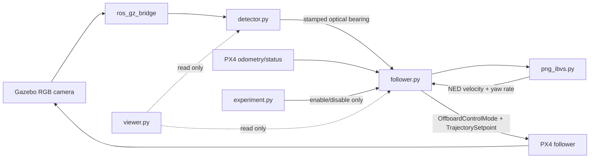

# Active architecture

## Scope

The active package has one monocular visual controller. Detector and estimator
choices are upstream of that controller and PX4 remains the downstream flight
stack. There is no runtime controller selector.



The target vehicle has its own `leader.py` PX4 adapter. Its telemetry is used by
the experiment recorder for evaluation and is never sent to the visual
controller.

## Component boundaries

| Component | Inputs | Outputs | Control authority |
|---|---|---|---|
| `detector.py` | RGB image, `CameraInfo` | `/target/bearing_camera`, diagnostics, debug image | None |
| `png_ibvs.py` | Normalized bearing, own attitude/velocity, state, parameters | NED velocity and yaw rate | Pure mathematics; no ROS/PX4 access |
| `follower.py` | Bearing, PX4 odometry/status, enable service | PX4 Offboard heartbeat/setpoint, metrics | Sole follower command publisher |
| `leader.py` | PX4 target state, movement service | Target PX4 setpoints | Target only |
| `experiment.py` | Health, images, diagnostics, both vehicle states | Lifecycle service calls, logs | Sequencing only |
| `viewer.py` | Images, diagnostics, follower metrics | Display | None |

## Frames

| Frame | Axes |
|---|---|
| Camera optical | x right, y down, z forward |
| Camera/body FRD | x forward, y right, z down |
| PX4 local NED | x north, y east, z down |

The detector publishes a normalized optical-frame ray. `follower.py` recovers
`bx=ray.x/ray.z` and `by=ray.y/ray.z`. `bearing_to_ned()` rearranges the ray to
camera FRD, applies `camera_mount_q`, then applies the PX4 body-to-NED attitude.

The follower retains timestamped attitude and velocity samples and evaluates
them at the image exposure timestamp. Attitude uses quaternion SLERP and
velocity uses linear interpolation; a small bounded latest-sample hold covers
minor callback skew. Each distinct image timestamp updates the guidance state
once, while faster setpoint ticks repeat the most recent command.

## Single-controller execution

The `/follow/enable` service has lifecycle meaning only:

- `false`: disable pursuit and clear `PNGIBVSState`;
- `true`: require healthy armed Offboard, fresh target observations, then create
  a new state and enable `intercept_command()`.

While enabled, there is exactly one calculation path:

```text
bearing -> inertial LOS -> LOS angles -> PNG-inspired desired direction
        -> bounded Eq. (14) speed magnitude -> NED velocity
horizontal image error -> yaw PD ------------------> yaw rate
```

The node never calls an alternative centring law. If state is unexpectedly
missing, it disables pursuit as an invariant fault.

## Reset behavior

`Follower.reset_guidance()` atomically disables pursuit and discards its
persistent state. It is used for explicit disable, odometry reset, unhealthy
state, disallowed PX4 manoeuvre, leaving armed Offboard, clock discontinuity and
target loss. Target loss also clears the detection count.

This prevents LOS and derivative history from one engagement being reused in a
later engagement. With `auto_reacquire=true`, visual-only loss retains the
operator's pursuit request for at most `reacquire_timeout_s`. Zero velocity is
published while `minimum_detections` new observations are collected; return to
control always creates a fresh `PNGIBVSState`. Health, PX4-state, estimator,
clock and explicit-disable resets never auto-resume.

## Timing

| Signal/block | Current behavior |
|---|---|
| Camera | 640x480, nominal 20 Hz from the SDF |
| Detector | Runs on camera callbacks |
| Follower | 20 Hz timer |
| Odometry | Latest received PX4 value |
| DKF | Not implemented |

The paper labels its controller at 200 Hz and its detection/DKF block at 50 Hz.
The current 20 Hz velocity adapter is therefore a documented implementation
difference. Reusing the latest bearing on a timer callback is not a new image
measurement.

## PX4 interface

The follower publishes:

- `/px4_1/fmu/in/offboard_control_mode` with velocity control enabled;
- `/px4_1/fmu/in/trajectory_setpoint` with NED velocity and yaw speed.

PX4 retains its velocity, attitude, rate and allocation loops. The paper's final
controller instead produces desired body angular velocity and physical lift.
The current interface must therefore be called a velocity-interface
reconstruction rather than Eq. (23).

## Experiment scenarios

| Scenario | Behavior |
|---|---|
| `observe` | Sensor/controller readiness without arming |
| `hover` | Takeoff and PX4 Offboard hover; visual pursuit disabled |
| `intercept` | Takeoff, Offboard, enable the one visual controller |

The active phase is named `INTERCEPTING`. Completion of a requested time
interval means the process remained healthy for that interval; it does not by
itself certify a control-performance objective.

Recorded CSV data includes image error, timestamps, north/east/down command,
yaw rate, controller state and both estimated vehicle positions. Target truth is
evaluation-only.

## Paper-conformance boundary

The current module contains useful pieces of Eqs. (3), (5)-(7), (9)-(10) and
(13), but it is not complete. In particular:

- Eq. (9) currently accumulates desired angles instead of using the prior
  measured velocity direction;
- the yaw loop currently consumes normalized error rather than the paper's
  clearly defined pixel error;
- Eq. (14) uses an explicit bounded `vd = ||vnow|| + ka` software policy;
- the vertical-excursion controller described by Eqs. (15)-(16) is absent;
- Eqs. (17)-(23) and the body-rate/lift interface are absent.

The exact binding and open questions are maintained in
[PAPER_CONTROLLER_CONTRACT.md](PAPER_CONTROLLER_CONTRACT.md). DKF is deferred;
the supplied paper delegates its details to reference [28].

## Validation boundary

Unit tests cover rotation, LOS geometry, the current discrete guidance update,
FOV yaw feedback, command limits and experiment lifecycle behavior. They do not
prove paper equivalence or closed-loop performance. A recorded SITL run must be
performed after this refactor before treating the runtime path as validated.
