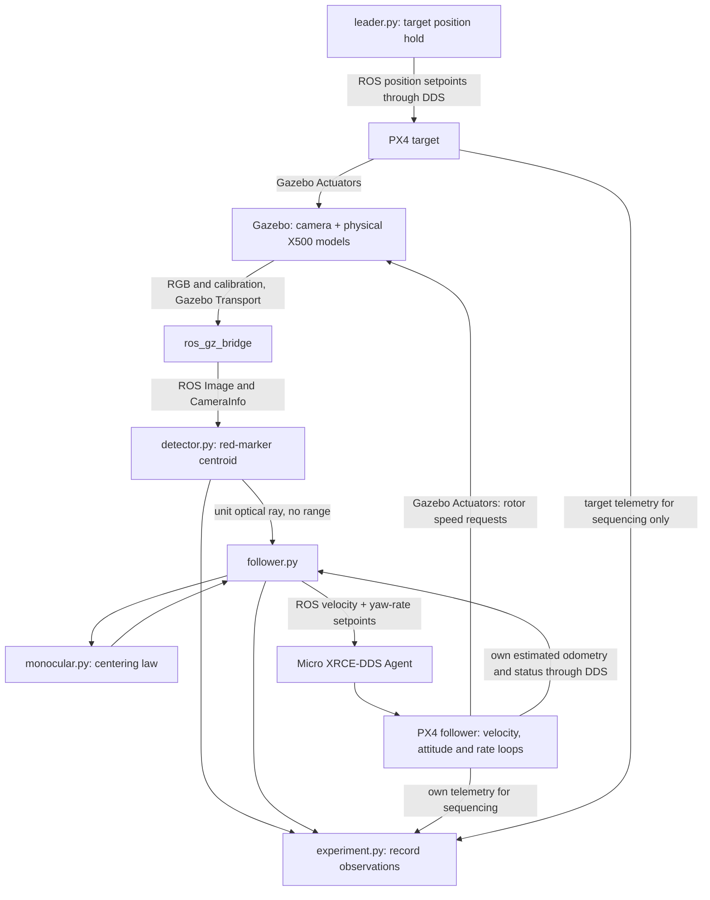

# Architecture and script guide

This guide covers the current `drone_ws/src/drone_follow` branch of the project.
It uses Gazebo, two PX4 simulated aircraft, ROS 2, and a **monocular image-centering
controller**. The current follower commands yaw rate and vertical speed; its north
and east velocity commands are zero. It does not estimate range or approach a
stand-off distance.

The previous RGB-D implementation is preserved in
`runs/drone-follow-before-monocular.tar.gz` at the repository root. Its detector
used depth and own estimated pose to publish `/target/point_ned`; that topic is
**not part of the current controller**. The old range-guidance code is archived, not present in the active package.
The older scripts outside `drone_ws` are separate experiments: they are neither
launched nor replaced by this baseline. Their Gazebo subscriptions alone do not
establish which command interface they use; see [LEGACY_AUDIT.md](LEGACY_AUDIT.md).

## 1. What has actually been verified

Local inspection on 2026-09-25 established the following. Runtime results from
the new launcher belong in the README/experiment log and each run's `result.json`;
this table is an environment audit, not a flight-validation claim.

| Item | Verified local state |
|---|---|
| OS | Ubuntu 22.04.1 LTS |
| Gazebo | Harmonic 8.11.0 and Garden 7.9.0 installed; the baseline explicitly selects major version 8 |
| ROS | ROS 2 Humble under `/opt/ros/humble` |
| Camera bridge | `ros-humble-ros-gzharmonic-bridge` 0.244.12-3jammy |
| PX4 | `/home/crl/PX4-Autopilot`, `release/1.15`, commit `85df8c2281c2466b30a121b22b0bf33dc69bcfe4`; SITL binary exists |
| ROS PX4 messages | `drone_ws/src/px4_msgs`, release/1.15, commit `a1045ec4feb6d709bdecaf3895f1d5b43a5dabb8` |
| DDS agent | `/usr/local/bin/MicroXRCEAgent`; source checkout reports `v2.4.2-dirty` |
| Python | Default shell Python is Conda 3.13.5; ROS runtime uses `/usr/bin/python3` 3.10.12 |
| Camera dependencies | System Python with `PYTHONNOUSERSITE=1` imports ROS, `cv_bridge`, OpenCV 4.5.4 and NumPy 1.21.5 successfully |
| Gazebo linkage | PX4 and ROS bridge both link Gazebo Transport 13 / Messages 10, matching Harmonic |

Historical logs from September 18 show the former ROS nodes running until the
user pressed Ctrl+C and the follower reporting `READY / ZERO VELOCITY`. For
example, `~/.ros/log/python3_2106874_1789722356339.log` contains that state. This
supports earlier communication readiness; it does not demonstrate successful
visual following, stable flight, or the new monocular controller. The old nodes'
exit code 1 after Ctrl+C was not evidence of a startup failure.

## 2. Follow the data and the commands



There are **two different bridges**. `ros_gz_bridge` converts camera/calibration
and clock messages into ROS messages. It carries no vehicle commands here.
PX4's internal `gz_bridge` consumes simulated flight sensors and publishes rotor
requests directly on Gazebo Transport. Between ROS and PX4, the Micro XRCE-DDS
Agent transports `px4_msgs`; it is not the camera bridge.

The complete motor path is verified in the local PX4 source:

- `src/modules/simulation/gz_bridge/GZMixingInterfaceESC.cpp` advertises
  `/<model>/command/motor_speed` as `gz.msgs.Actuators`, filling its velocity array.
- `Tools/simulation/gz/models/x500/model.sdf` has four
  `gz::sim::systems::MulticopterMotorModel` plugins. They consume
  `command/motor_speed` and apply rotor dynamics, thrust and torque through the
  physical model. These are not direct pose commands.
- `src/modules/commander/ModeUtil/control_mode.cpp` enables PX4's velocity,
  attitude, angular-rate and allocation controllers for velocity Offboard mode.
  Position feedback is bypassed for the follower. The target's position mode
  keeps the position loop too.

## 3. Frames, units, and time

| Name | Meaning / units |
|---|---|
| Gazebo world ENU | x east, y north, z up; metres; initial vehicle nose is east |
| Vehicle model FLU | x forward, y left, z up; camera mount `[0.30, 0, 0.10]` m |
| PX4 local NED | x north, y east, z down; position m, velocity m/s; each aircraft has its own estimated local origin |
| Camera optical | x right, y down, z forward; `follow_camera_optical` unit ray is dimensionless |
| Image coordinates | u right, v down; pixels; principal point `(cx, cy)` comes from CameraInfo |
| Yaw command | positive clockwise when viewed from above in NED; radians/second |
| Image/ROS control time | Gazebo simulation time from `/clock`; image header stamps retained |
| PX4 setpoint stamp | simulation time converted to integer microseconds by project nodes |
| Watchdog/experiment time | monotonic host seconds for freshness, readiness and bounded run duration |

Detector, follower and leader use `use_sim_time: true`. Their timer rates are
simulation-time rates, so pausing Gazebo pauses these timers. The experiment node
deliberately uses wall time and detects a stalled simulation clock. PX4 odometry
has its own timestamp fields, but current freshness checks use receipt time;
they do not claim exact sensor-time alignment. Simulator performance and actual
received rates must be measured, not inferred from configured update rates.

The vertical centering law assumes a nearly level aircraft with this forward
camera mount. A pitched/rolled aircraft couples image motion to more axes; the
current law does not compensate those couplings. Own odometry is used for flight
health, not to reconstruct target range or target position.

## 4. Exact runtime interfaces

`GZ` means Gazebo Transport; `ROS` means ROS 2. Identical names do not make their
message systems interchangeable.

| Bus and interface | Type | Producer → consumer |
|---|---|---|
| GZ `/world/follow_world/clock` | `gz.msgs.Clock` | simulator → camera bridge |
| ROS `/clock` | `rosgraph_msgs/msg/Clock` | bridge → ROS simulation clocks, experiment |
| GZ `/follow_camera/image` | `gz.msgs.Image` | camera → bridge |
| ROS `/follow_camera/image` | `sensor_msgs/msg/Image` | bridge → detector, experiment |
| GZ `/follow_camera/camera_info` | `gz.msgs.CameraInfo` | camera → bridge |
| ROS `/follow_camera/camera_info` | `sensor_msgs/msg/CameraInfo` | bridge → detector, experiment |
| ROS `/target/bearing_camera` | `geometry_msgs/msg/Vector3Stamped` | detector → follower |
| ROS `/target/observation` | `std_msgs/msg/String` containing JSON | detector → experiment |
| ROS `/target/debug_image` | `sensor_msgs/msg/Image` | detector → optional image viewer |
| ROS `/follow/state` | `std_msgs/msg/String` | follower → optional diagnostic consumer |
| ROS `/follow/metrics` | `std_msgs/msg/String` containing JSON | follower → experiment |
| ROS `/follow/enable` | service `std_srvs/srv/SetBool` | experiment or user → follower |
| ROS `/target/move` | service `std_srvs/srv/SetBool` | user → leader; baseline scenarios leave target stationary |
| ROS `/px4_1/fmu/out/vehicle_odometry` | `px4_msgs/msg/VehicleOdometry` | follower PX4/DDS → follower, experiment |
| ROS `/px4_1/fmu/out/vehicle_status` | `px4_msgs/msg/VehicleStatus` | follower PX4/DDS → follower, experiment |
| ROS `/px4_2/fmu/out/vehicle_odometry` | `px4_msgs/msg/VehicleOdometry` | target PX4/DDS → leader, experiment |
| ROS `/px4_2/fmu/out/vehicle_status` | `px4_msgs/msg/VehicleStatus` | target PX4/DDS → leader, experiment |
| ROS `/px4_1/fmu/in/offboard_control_mode` | `px4_msgs/msg/OffboardControlMode` | follower → PX4/DDS |
| ROS `/px4_1/fmu/in/trajectory_setpoint` | `px4_msgs/msg/TrajectorySetpoint` | follower → PX4/DDS |
| ROS `/px4_2/fmu/in/offboard_control_mode` | `px4_msgs/msg/OffboardControlMode` | leader → PX4/DDS |
| ROS `/px4_2/fmu/in/trajectory_setpoint` | `px4_msgs/msg/TrajectorySetpoint` | leader → PX4/DDS |
| GZ `/follower/command/motor_speed` | `gz.msgs.Actuators` | follower PX4 → X500 motor plugins |
| GZ `/target/command/motor_speed` | `gz.msgs.Actuators` | target PX4 → X500 motor plugins |

PX4's own simulator bridge also subscribes to
`/world/follow_world/model/<name>/link/base_link/sensor/imu_sensor/imu`
(`gz.msgs.IMU`), the corresponding `air_pressure_sensor/air_pressure`
(`gz.msgs.FluidPressure`), and `navsat_sensor/navsat` (`gz.msgs.NavSat`), where
`<name>` is `follower` or `target`. It reads
`/world/follow_world/pose/info` (`gz.msgs.Pose_V`) for the simulator's truth/sensor
machinery. That does **not** expose target truth to the visual controller.
The X500 model configures IMU 250 Hz, pressure 50 Hz and NavSat 30 Hz; PX4 ROS
telemetry rates are not set by the project and should be measured per run.

## 5. Every project script, in execution order

### Launch and ownership

| Script | Start, purpose, important steps | Failure / data privileges |
|---|---|---|
| Repository-root `run_baseline.sh` | Single user entry point. Establishes system executable paths, disables Python user packages, clears conflicting Python/ROS/Qt settings, sources Humble/workspace and executes `scripts/baseline.py` with system Python. | Missing workspace setup aborts. Changes only its child environment. No sensor data or control math. |
| `scripts/baseline.py` | `main()` obtains workspace lock, loads `config/follow.yaml`, applies CLI overrides; `preflight()` checks imports, files, existing PX4 processes and agent port; `snapshot()` saves config/source/hash/versions and generates the effective world with configured initial follower yaw; starts ROS launch in an owned process group. Watches exit and writes final result. | Refuses duplicate owned run, existing PX4 or busy agent port; does not kill those processes. Ctrl+C signals owned group, then bounded escalation if it will not exit. No measured target state or controller math; monotonic process supervision. |
| `launch/baseline.launch.py` | Started by wrapper. Builds Gazebo, agent, two PX4 processes, bridge, detector, follower, leader and experiment actions. Reads saved config and uses a workspace source link by default, or a saved copy with recording. | With `keep_open: true`, required exits are reported without shutting down surviving processes. With explicit `keep_open: false`, they stop this launched stack. PX4 uses separate run work directories. No target state. |

No fixed waiting time alone declares the full stack ready. Startup actions may
run concurrently, but `experiment.py` gates flight on observed stream health,
preflight status, armed status, stable hover, and confirmed Offboard mode.

### Detector: `drone_follow/detector.py`

Starts as the `detector` process; its `main()` initializes ROS and spins the node. It runs when images arrive, nominally 20 Hz. Its only inputs are
the RGB image and calibration in the interface table: **no depth, own pose or
target pose subscriptions**.

Execution order:

1. `__init__()` declares topic, maximum-image-age and minimum-marker-area
   parameters, initializes `CvBridge`, limits OpenCV to one CPU worker, and
   creates subscriptions/publishers. RGB uses reliable QoS with queue depth 2,
   matching the bridge's reliable publisher; calibration uses sensor QoS.
2. `calibration()` stores the latest intrinsic matrix and image dimensions.
3. `images()` obtains the image timestamp and simulation-time age. It rejects
   absent/inconsistent calibration or images outside the configured 0–0.2 s age.
4. BGR→HSV conversion isolates two red hue bands. Connected components must
   contain exactly one candidate with at least 12 pixels; ambiguity is rejected.
5. The component centroid `(u,v)` becomes normalized coordinates
   `x=(u-cx)/fx`, `y=(v-cy)/fy`. The published ray is
   `[x,y,1]/sqrt(x²+y²+1)` in optical right/down/forward axes.
6. Every received image produces an observation JSON, including negative
   detections and their reason. Accepted detections include pixel/normalized
   errors, area, bounding box and exact integer image timestamp. A debug image with green marker pixels is published when a
   viewer subscribes.

The ray is a direction: multiplying it by any positive distance would describe
another possible target point. No range is inferred from a centre pixel or from
marker area. Synthetic imagery is the sensor; no privileged target state is read.
If images stop, there are no observation callbacks; the experiment watchdog
detects stream loss. If detections stop, follower freshness expires.

### Controller mathematics: `drone_follow/monocular.py`

This is a pure function module, imported by the follower, with no ROS/Gazebo
dependency, clock, topic, or ground-truth access. `centring_command()` validates
finite inputs and gain/limit signs, then calculates:

```text
horizontal bearing angle = atan(x)
yaw_rate = clamp(yaw_gain × atan(x), ±max_yaw_rate)   [rad/s]
down_speed = clamp(vertical_gain × y, ±max_vertical_speed) [m/s]
north_speed = east_speed = 0
```

Defaults are yaw gain 0.8 s⁻¹, vertical gain 0.6 m/s per unit normalized error,
maximum yaw rate 0.3 rad/s, and maximum vertical speed 0.4 m/s. Positive horizontal
error turns the nose toward a marker on the right; positive vertical error moves
down toward a marker below the principal point. This is an empirical centering
baseline under the level-hover assumption, not a paper-specific controller or a
global stability proof. Invalid function inputs raise an exception.

### PX4 adapter: `drone_follow/follower.py`

Starts as the `follower` process, with a 0.05 s simulation-time timer (20 Hz).
It subscribes to own PX4 estimated odometry/status and the optical bearing.
It exposes `/follow/enable`, publishes both PX4 input messages, and reports
state/metrics. Namespaces and controller gains are in `config/follow.yaml`.

Execution order:

1. `__init__()` validates controller settings through the pure function and
   installs subscriptions, service and timer.
2. `odom()` and `status()` record latest own telemetry and monotonic receipt
   times. An estimator reset disables centering; a reset while armed in Offboard
   also latches a fault.
3. `target()` validates optical frame, finite forward-facing ray, increasing
   image stamps and age. `fresh()` requires six accepted detections and both
   simulation-time and wall-time age below 0.3 s.
4. `enable()` accepts `true` only with healthy own telemetry, armed Offboard
   state and fresh measurements. `false` disables centering.
5. `tick()` checks health and mode, recovers normalized errors as `ray.x/ray.z`
   and `ray.y/ray.z`, calls `centring_command()`, and sends PX4 velocity mode.
   `TrajectorySetpoint.velocity=[0,0,down]`; position/acceleration/jerk/yaw are
   NaN, and `yawspeed` is the requested yaw rate.
6. It reports `/follow/state` and a JSON containing measurement age, freshness,
   enabled state, requested NED velocity and yaw rate, control and measurement
   timestamps, and whether an external setpoint was actually published.

`may_stream()` is an important handoff check: while armed, external setpoints
are allowed only in Offboard, position hold or auto loiter. In autonomous
takeoff, landing and other modes they pause. The uXRCE input shares PX4's
`trajectory_setpoint` with internal controllers; repeatedly sending zero during
landing interfered with its demanded-descent/ground-contact detection in an
earlier run. This is an observed interface issue, not a controller-gain issue.

Telemetry must be finite in NED; odometry receipt age must be <0.3 s and status
age <2 s. Stale/invalid own state stops Offboard heartbeats, leaving PX4's
configured Offboard-loss action to act. Detection loss disables centering and
requests zero velocity; reacquisition requires another enable call. Normal mode
exit and a simulation-time jump also disable it. These commands do not guarantee
collision avoidance against an unseen moving target.

Own estimated position/velocity/attitude are checked for health but do not enter
the image-centering equation. The adapter does not subscribe to target telemetry.
When health is invalid, metrics show zero requested outputs but **no new PX4
setpoint is published**; read the state with the numbers.

### Target generator: `drone_follow/leader.py`

Starts as `leader`; 20 Hz simulation-time timer. Subscribes only to target PX4
estimated odometry/status under `/px4_2`, publishes position-mode setpoints there,
and exposes `/target/move`. `odom()`/`status()` update health, `move()` captures the
current origin and start time, and `tick()` holds that origin or adds:

```text
[north, east, down] offset = [2 sin(0.16t), 4 sin(0.08t), 0] m
```

The optional figure eight has combined speed ≤0.453 m/s. The initial baseline
scenarios do not enable it. `false` holds the current target position, not its
original starting point. Stale odometry/status stops its heartbeats; estimator
resets disable motion, and a backwards clock can latch a fault. It reads the
target's own estimated telemetry for scenario generation and never supplies it
to the visual controller. It reads no Gazebo ground-truth topic.
Like the follower, it pauses external setpoints during armed autonomous
takeoff/landing instead of overwriting PX4's own trajectory.

### Sequencer and recorder: `drone_follow/experiment.py`

Starts as `experiment` from the complete launch, using saved run configuration.
It is intentionally outside the visual controller and can see both aircraft's
estimated odometry/status. It also receives clock, camera/calibration,
observations and controller metrics. Its timer runs every 0.2 wall seconds;
low-rate events are always saved; per-frame event/CSV recording is opt-in.

Execution order:

1. `__init__()` opens `events.jsonl` and, only with `record: true`, `measurements.csv`, subscribes to streams
   and creates the follow-enable client. `clock()` requires increasing time;
   callbacks record receipt freshness. `image()` saves one raw image per stage only with recording;
   `camera_info()` saves `camera.json` with intrinsics and `range_source: none`.
2. `advance()` waits for advancing clock, image/calibration, detector/controller
   and both PX4 estimates/statuses, at least five calibrated, fresh observations
   with increasing image timestamps, and non-invalid controller state.
   A valid image with a negative detection still counts as an observation;
   **observe readiness does not require marker visibility**.
3. `observe` records without flight. `hover` and `centre` configure simulation
   parameters through `command()`, which invokes local `px4-param` / `px4-commander`
   clients with `--instance 1` or `2`. This command interface is PX4's local IPC,
   not a ROS topic or direct Gazebo pose service.
4. It waits for normal preflight checks, commands arm, verifies armed state,
   commands takeoff, then requires altitude within 0.5 m of the requested climb
   and speed <0.35 m/s on both aircraft. Both must be in auto loiter/position hold
   with fresh Offboard heartbeat publications throughout a two-second observation
   interval before requesting Offboard. It then confirms that mode in telemetry.
5. `hover` records; `centre` additionally requires fresh detections and a
   successful `/follow/enable` response. It fails on leaving armed Offboard or
   centering becoming disabled. Duration is measured in wall seconds.
6. `duration_s: 0` leaves the behaviour running. At an explicitly bounded
   completion, `auto_land: false` disables centring without requesting landing.
   Only explicit `auto_land: true` requests landing and waits for both to disarm.
   `finish()` saves counts, visibility, image timing, stamp ordering, altitude
   extrema and pixel-error summaries. With `keep_open: true` it halts sequencing
   but keeps the node and simulation alive for inspection. Timing samples use
   a bounded 6,000-image window; counts, extrema and error sums are accumulated
   without retaining an indefinite list. `main()` saves an interrupted summary
   on Ctrl+C if the sequence did not already finish or fail.

Simulation parameters include no-stick operation, takeoff altitude, Offboard
loss delay/action, and `NAV_DLL_ACT=0` so this owned simulation need not depend on
a separate GCS heartbeat. Normal preflight checks remain active. These values
are set in the run's separate PX4 working directories; this is a SITL sequencer.

Each stream has a wall-time stale timeout and startup/flight stages have bounded
timeouts. A stream failure reports a failed run and stops sequencing. With the
default `keep_open: true`, it requests centring disabled when possible and leaves
the simulation open; required-component exits are also reported without a global
shutdown request. PX4 failsafes remain active. Ctrl+C terminates the simulated stack; it is not the same
as completing the monitored landing sequence. The recorder reads no Gazebo truth
and never feeds target telemetry into the bearing/controller topics.

CSV image rows contain the **latest received** control metrics and both aircraft's
estimated odometry (for evaluation/sequencing, never fed back to the visual law);
they are not interpolated to the image exposure timestamp. JSONL preserves
separate image/control event times. CSV includes `control_stamp_s` and
`control_measurement_stamp_s` to make this distinction inspectable. The two
aircraft have different local NED origins: subtracting their logged positions
does not give a valid inter-vehicle range without an explicit frame alignment.
`passed` currently means the requested
scenario completed its state checks; there is no automatic pixel-error threshold
certifying successful centering. Inspect the recorded error and image evidence.

### Stream display: `drone_follow/viewer.py`

The complete launch starts this optional process by default in GUI mode.
`--headless --viewer` shows only the camera; `--no-viewer` disables it. It publishes
no topics and calls no control services. Its subscriptions are:

| Input | Type | Role |
|---|---|---|
| `/follow_camera/image` (configurable) | `sensor_msgs/msg/Image`, reliable depth 1 | Latest raw RGB image. |
| `/follow_camera/camera_info` (configurable) | `sensor_msgs/msg/CameraInfo`, sensor QoS | Intrinsics/principal point. |
| `/target/observation` | `std_msgs/msg/String` JSON | Stamp-matched detection and bounding box. |
| `/follow/metrics` | `std_msgs/msg/String` JSON | Latest yaw-rate/climb commands, enabled/publication state. |
| `/px4_1/fmu/out/vehicle_odometry` (namespace configurable) | `px4_msgs/msg/VehicleOdometry`, sensor QoS | Actual estimated attitude, never target truth. |
| `/clock` | `rosgraph_msgs/msg/Clock`, sensor QoS | Image-age display in simulation seconds. |

Execution order:

1. `main()` reads the saved run config, initializes OpenCV/ROS, and creates
   `Viewer`. A ROS executor runs callbacks on a background thread; HighGUI
   remains on the main thread.
2. `image()` keeps at most four newest image references. It never queues an unbounded
   history. `observation()` retains a small stamp-indexed cache so detection
   boxes are overlaid only on their own image.
3. `calibration()`, `control()`, `odom()` and `clock()` store their latest data.
   `attitude_degrees()` converts normalized Hamilton FRD-to-NED quaternion into
   heading and nose-up pitch, in degrees.
4. `snapshot()` takes a short lock and calls `select_frame()`. It selects the
   newest exact image/detection pair with a maximum wall age of 80 ms; otherwise
   it selects the newest raw frame and marks detection pending. It never rewinds
   to an older image after displaying a newer one. This is display buffering,
   not a delay added to control. The main loop converts
   only a new image to BGR. `draw_hud()` adds the crosshair, detection box, centroid,
   arrow, magnified crop and telemetry panel to a display copy.
5. The GUI redraws at at most `viewer_fps` (default 60); source camera rate stays
   20 Hz. The HUD separately counts image arrivals and distinct displayed frames
   in wall time, not UI redraws. `window_closed()` probes `WND_PROP_FULLSCREEN`
   without changing the window. `WND_PROP_VISIBLE` is unsupported by the local
   GTK backend and formerly caused an immediate clean exit.
6. Images older than `viewer_stale_s` in wall time are dimmed and marked stale;
   old detections are hidden. Commands and attitude have independent wall-age
   checks. Q/Esc/window close cleans up only the viewer. Terminal Ctrl+C stops
   the whole owned simulation through the existing supervisor.
7. With `--record`, two diagnostic HUD images are saved at first visible detection and after
   two seconds of enabled centring. On exit, `viewer.json` records the reason,
   whole-run frame counts and software timing over the latest 6,000 displayed
   frames. Timing is from image callback to render submission, not exposure to
   monitor. No per-frame video encoding competes with the simulator.

The display distinguishes three quantities:

- Camera yaw/pitch **alignment errors**, derived only from image bearing:
  `yaw_error=atan(x)` and `pitch_error=atan2(-y,sqrt(1+x*x))`, shown in degrees.
  Right and up are positive respectively. These are not an attitude setpoint.
- Actual PX4 yaw/pitch estimated attitude (live telemetry, not exposure-aligned).
- Actual project output: yaw rate and vertical speed. Climb speed is `-v_down`.
  The HUD explicitly states **Pitch command: NONE** because this controller
  does not command pitch directly. During PX4-owned manoeuvres it marks external
  publication paused instead of presenting zero as a published control action.

No motion smoothing or artificial frames change research measurements. The
26 September live tests measured about 20 distinct displayed FPS with matching
detections; see `EXPERIMENT_LOG.md` for run IDs, pacing and flight limitations.
Its failure cannot feed back into the controller. A viewer exit is reported in
launch output while the experiment continues; errors are in its component log.

### Package files and tests

- The obsolete range-guidance module, its six tests, and alternative manual
  launch scripts were removed after being archived in
  `runs/cleanup_20260926_111608.tar.gz`. None belongs to the active control path.
- `test/test_monocular.py`: current controller sign/limit checks and idealized
  fixed-target yaw convergence. The ideal plant applies the requested yaw rate
  immediately; it does not represent full PX4/Gazebo flight dynamics, camera
  latency or vertical coupling.
- `setup.py`: installs package data and three ROS entry points; `setup.cfg`
  selects the ROS executable installation directory. `__init__.py` is a package
  marker. These are build/import support, with no control messages or rates.

## 6. World, models and configuration

| File | Role |
|---|---|
| `config/follow.yaml` | Main user settings: launch/scenario limits, PX4 path, ROS domain, DDS port, detector and centering parameters. Read at startup; restart for changes. |
| `config/bridge.yaml` | Three one-way GZ→ROS mappings: clock, RGB and calibration. No depth bridge. |
| `worlds/follow_world.sdf` | Ground, sun, gravity, geographic reference, physics/sensor plugins and two model placements. Physics step 0.004 s, desired real-time factor 1. |
| `models/x500_follower/model.sdf` | Includes upstream PX4 X500 with a forward **camera**, 640×480 at 20 Hz, approximately 80° horizontal FOV; no depth sensor. Rendering clip 0.1–50 m is not a range measurement. |
| `models/x500_target/model.sdf` | Includes upstream X500 and a radius-0.30 m red sphere, 0.40 m above its base link. The detector uses color, not a pretrained semantic drone detector. |
| `models/*/model.config` | Gazebo model discovery metadata. |
| `package.xml` | Declares ROS/build/runtime dependencies. |
| Upstream PX4 `x500` / `x500_base` models | Meshes, inertias, rotors, flight sensors and physical motor plugins; referenced through the configured PX4 checkout. |

The default world initially places the target 18 m east of the follower. The
launcher writes `world.sdf` in the run directory with the configured
`baseline.follower_yaw_deg` (currently 12 degrees in your configuration). These are **scenario parameters**,
not sensed range or controller inputs. There is no
ground-truth target-pose subscription or pose-setting service in the current
project-owned control path.

## 7. One numerical trip around the loop

Suppose the marker centre is at `(u,v)=(400,240)` pixels, the principal point is
`(320,240)`, and `fx≈381` pixels. The actual runtime uses CameraInfo; the number
381 here follows the nominal 640-pixel width and 80° FOV.

1. The horizontal pixel error is `400−320=80` px; vertical error is zero.
2. `detector.py` computes `x=80/381≈0.210`, `y=0`, then publishes the unit optical
   ray approximately `[0.206,0,0.979]` with the original image timestamp.
3. On its next tick, `follower.py` checks age/health/enable state and divides the
   ray's x and y by its z to recover those normalized errors.
4. `monocular.py` computes `0.8×atan(0.210)≈0.166 rad/s`, below the 0.3 rad/s
   cap, and down speed zero.
5. The adapter requests NED velocity `[0,0,0]` and yaw speed `+0.166 rad/s`
   through `/px4_1/fmu/in/trajectory_setpoint`, accompanied by velocity-mode
   Offboard heartbeats. It does not publish a body angular-rate vector or thrust.
6. PX4 maintains the velocity request while its yaw/attitude/rate machinery and
   motor allocation turn the simulated aircraft. Motor requests reach
   `/follower/command/motor_speed`; Gazebo applies the motor dynamics and forces.
7. For a stationary marker in the assumed hover geometry, turning right should
   move it left toward the principal point in the next image, reducing the next
   command. Actual response and overshoot must be read from the recorded data.

At no step can we determine whether that ray meets a target 5 m or 50 m away.
For a separate vertical example, a normalized error `y=0.1` requests
`0.6×0.1=+0.06 m/s` down under the level-hover assumption.

## 8. Why retain this architecture for this baseline?

| Option | Fit to this repository and the current task | Main cost / control loops |
|---|---|---|
| Existing Gazebo/Python interfaces | Preserve the separate earlier experiments. A suitable choice when their actual command path already supports the intended controller. Gazebo subscriptions can coexist with PX4 through a different command interface. | Must audit each publisher/service and plugin. Direct motor or kinematic commands have different retained loops and fidelity; a topic subscription alone cannot answer this. |
| PX4 SITL + MAVSDK Python | Can present a compact API for PX4 control and telemetry while camera data still needs a simulator interface. | Requires a new adapter for this already functioning ROS branch and still needs process supervision. Retained PX4 loops depend on whether position, velocity, attitude or rate commands are selected. |
| PX4 SITL + ROS 2 / `px4_msgs` | Already present, built and modular here: camera bridge, typed autopilot messages, services, launch and recording. Keep it for the current baseline. | More concepts initially, but fewer architectural changes now. Current velocity interface retains PX4 velocity/attitude/rate loops and allocation. |

Terminal count is a launch problem, not a reason to replace a working message
interface. The selected launcher reuses ROS launch rather than adding containers
or replacing existing flight-control infrastructure. It isolates controller math
(`monocular.py`) from message adaptation (`follower.py`) and experiment sequencing
(`experiment.py`).

The second paper's angular-velocity/thrust outputs would need a different
interface and a separately validated implementation. PX4 `VehicleRatesSetpoint`
uses roll/pitch/yaw rates in rad/s plus **normalized body thrust**; a force in
newtons cannot be copied into that field. In PX4 body-rate Offboard mode the
angular-rate loop and allocation remain, while position/velocity/attitude loops
are bypassed. The current yaw-rate-plus-vertical-velocity demonstration keeps
additional loops and therefore is not a faithful realization of those outputs.

No equation in the current centering function is attributed to either paper.
Paper-specific equations, assumptions, thrust conversion, delay treatment and
stability claims require their own derivation and validation before integration.
There is no metric approach milestone without an explicitly chosen range or
scale-observability assumption; that work remains separate from centering.

## 9. Run and try one small experiment

From the repository root:

```bash
bash run_baseline.sh --check
bash run_baseline.sh --headless --viewer --scenario observe
```

The first command checks dependencies. The second launches the full stack,
reports readiness without commanding flight and stays open until Ctrl+C.
`--headless` hides both windows unless `--viewer` is also given; `--debug`
also prints component output. Minimal recording is the default: configuration,
manifest, runtime files, low-rate events and summaries. `--record` adds independent
source snapshots, detailed logs, images, per-frame CSV/JSONL and PX4 ULogs.
Minimal mode disables external ROS node log files and uses the installed PX4
`px4-rc.params` startup hook to set `SDLOG_MODE=-1` in the owned SITL instances.
No upstream PX4 file is edited. Read the experiment log before treating
`hover` or `centre` as validated on this machine.

For a simple gain experiment after a successful centering run, change only
`follower.ros__parameters.yaw_gain` from `0.8` to `0.4` in `config/follow.yaml`
and repeat the same `--scenario centre --record` run. For the same 80-pixel unsaturated
error the requested yaw rate should halve to about `0.083 rad/s`. Compare saved
image error and commands using the same initial scene and duration. Slower
commands do not by themselves prove better tracking. If the marker starts
already centered, little yaw response is expected. For a separate one-parameter
experiment, set `baseline.follower_yaw_deg: 10.0` to begin with a heading error;
keep that initial heading identical when comparing gains.

## 10. Paper reading: what is, and is not, implemented

The equation pages were extracted and visually inspected in this session.
The current code implements neither paper's final controller. It is a simpler
monocular centring demonstration on a velocity interface.

| Reference | Relevant method and assumptions | Difference from this baseline |
|---|---|---|
| Yang et al., *An Autonomous Intercept Drone with Image-based Visual Servo*, local `202008YangAnAutonomous.pdf` | PDF pp. 2–4: target centre, calibrated camera/body geometry, own attitude/velocity. Eq. (4) maps optical right/down/forward to body forward/right/down. Eq. (21), printed p. 2233, outputs body angular velocity and thrust. Figure 7 shows perception 20 Hz/control 100 Hz. | Our camera has a nonzero mount offset; the empirical law does not implement their interaction matrix or longitudinal/lateral controller. Our PX4 velocity/attitude loops remain active. |
| *Precise Interception Flight Targets by Image-based Visual Servoing of Multicopter*, local `2409.17497v2.pdf` | PDF pp. 3–4: Eq. (5) forms a unit LOS from camera measurement and attitude; Eqs. (6)–(10) design a velocity direction; Eq. (23) outputs angular velocity and thrust. Figure 3 places a flight controller between those outputs and motor PWM. | Desired velocity is only an intermediate quantity in the paper. Sending velocity setpoints to PX4 is not a faithful implementation of its final outputs. No delayed Kalman filter or paper stability proof is implemented here. |

The first PDF is at `/home/crl/Downloads/Papers/202008YangAnAutonomous.pdf`;
the second at `/home/crl/Downloads/Papers/2409.17497v2.pdf`. Use those exact
revisions when checking the following audit notes. Page numbers refer to PDF
pages unless a printed page is specified.

Issues to resolve before a future implementation (these are suspected notation
or missing-assumption issues, not silent corrections):

- **Pixel versus normalized error:** in the second paper, Eq. (3) defines pixel
  error while Eq. (4) uses the normalized-coordinate interaction matrix. The
  focal-length scale/convention needs explicit reconciliation. Related
  normalization choices occur around Eqs. (7), (17), (22) of the first paper.
- **Thrust dimensions:** second-paper Eq. (23) prints a projection containing
  `a_d - m g`, while Eqs. (2)/(17) define `g` and `a_d` as accelerations.
  Acceleration minus force is dimensionally inconsistent as printed. Determine
  the intended mass/thrust convention before coding it.
- **Rotation construction:** second-paper Eq. (19) uses a cross product as a
  rotation-axis quantity. Its normalization and parallel/antiparallel cases
  require explicit treatment.
- **Axis ordering:** the yaw contribution below second-paper Eq. (23) is printed
  in the first vector component; reconcile that with the depicted body axes
  before mapping to PX4 roll/pitch/yaw-rate fields.
- **Time-step dependence:** second-paper Eqs. (14)/(17) combine a velocity
  increment with division by `dt`. Clarify whether the gain represents a speed
  increment or acceleration; do not let a timer change alter physical meaning.

Both methods require more than an uncalibrated target pixel: own vehicle state,
camera calibration/extrinsics, visibility and motion assumptions also matter.
A pixel-centre ray does not establish metric distance. The second paper's Eq.
(11) treats horizontal centring and vertical-error variation differently; our
simple two-axis centring law is a documented departure, not a copied equation.
A future comparison must use the same sensing, target motion, timing and
actuator bounds. Gazebo use or adding a Kalman filter alone is not novelty.

## 11. Learning path before you add a non-contact approach

This is a study plan for your own implementation, not a new executable mode.
The next objective is approaching a cooperative target and stopping at a stated
stand-off distance. The current launcher accepts only `observe`, `hover` and
`centre`. There is no switch that turns this baseline into the papers' controller.

### Understand the existing command first

`detector.images()` obtains a pixel centroid `(u,v)` and the calibrated optical
ray `b_c = normalize([(u-cx)/fx, (v-cy)/fy, 1])`.
`follower.target()` checks its frame, timestamp and freshness.
`follower.tick()` calls `monocular.centring_command()` and publishes
`TrajectorySetpoint.velocity = [0, 0, down]` in NED, in metres/second, and
`yawspeed` in radians/second. Those first two zeros explain why it does not
approach. `/follow/enable` only enables this existing centring law; it is not
an approach command. The experiment already calls that service in `centre` mode.

For a target 80 px right of centre and `fx=381 px`, `x=80/381=0.210`.
The present controller requests `0.8 atan(x)=0.166 rad/s`, about 9.5 deg/s
clockwise in NED. It knows a direction, not how far away the target is.
`viewer.py` displays `atan(x)` as yaw alignment and the vertical bearing as
pitch alignment. Its attitude readout comes from the vehicle quaternion.
Neither label is a pitch command: the controller uses vertical translation.

The latest 12 s centring run reduced horizontal error from +82.48 to +0.07 px,
but vertical error changed from -12.19 to -33.56 px. Do not treat a completed
takeoff/landing sequence or a centred horizontal coordinate as validation of
the full visual controller. First examine `error_v_px`, measured pitch, vertical
velocity and image age together; distinguish camera rotation from translation.

### Read the papers as a chain, not as a formula to paste

For `2409.17497v2.pdf`, read PDF pages 3–4 in this order:

1. Equations (3)–(5): pixel error, normalized camera coordinates and the
   earth-frame line of sight. The essential geometric step is
   `b_e = R_b_to_e R_c_to_b b_c`. It uses calibrated camera mounting and own
   attitude. A change in pixel position can come from camera rotation even if
   the target is stationary; raw pixel differences are not world LOS rates.
   For moving flight, interpolate attitude to the image timestamp before this
   transform. Our HUD deliberately labels its latest attitude as unaligned.
2. Equations (6)–(10): the paper designs a desired velocity **direction** from
   line-of-sight motion. Desired direction and speed are distinct quantities.
   This is an intermediate construction, not the current `centre` controller.
3. Equation (11): its objective is horizontal centring with bounded vertical
   image variation. It does not promise both pixel errors are always zero.
   Equations (12)–(16) address field-of-view effects of vehicle motion/tilt.
4. Equations (17)–(23): the paper proceeds through desired acceleration and
   attitude to final **body angular velocity and thrust**. Thus setting a
   forward velocity in this package would be an initial velocity-interface
   experiment, not reproduction of Eq. (23). Resolve the units/axis issues in
   section 10 before attempting that separate controller.

In `202008YangAnAutonomous.pdf`, Eq. (4) supplies a camera-to-body rotation and
Eq. (21), PDF page 4, also ends in body angular velocity and thrust. Its
longitudinal/lateral derivation is different from the 2024 method. Do not mix
their gains, coordinate assumptions or equations merely because the symbols
look similar. Our nonzero camera mounting offset is another departure.

For the present velocity interface, PX4 keeps its velocity, attitude, angular
rate and motor allocation loops. A body-rate/thrust interface would keep the
rate loop and allocation while bypassing velocity/attitude control. Paper force
in newtons is not directly the normalized thrust field used by PX4; the vehicle
thrust model and sign convention must be established separately.

### Your next implementation milestones

1. **Define and validate sensing before adding forward motion.** Monocular
   bearing alone cannot certify a metric stand-off. One possible learning
   experiment uses a cooperative planar marker of known physical height `H`,
   facing the camera. The pinhole relation gives optical-axis distance
   `Z = fy H / h_px`. Example: `fy=381 px`, `H=0.5 m`, `h_px=38 px` gives
   `Z≈5.01 m`. A one-pixel height error here changes Z by about 0.13 m.
   This assumes known size, calibrated projection, negligible distortion and
   the specified pose. It is not a valid unqualified formula for an arbitrary
   drone silhouette or the current red sphere. Euclidean range also differs
   from Z for an off-axis target. A planar pose estimate is another option
   when corner correspondences and marker geometry are known.
2. **Evaluate the range estimate without feeding it into control.** Add its
   timestamp, validity and uncertainty to diagnostics. Compare with simulator
   truth only in evaluation, with camera extrinsics and world origins handled
   explicitly. Invalid size, occlusion or wrong target identity must not become
   a plausible-looking distance. Do not use target telemetry as visual range.
3. **Write the stand-off policy as a small pure module.** Keep the existing
   `monocular.py` baseline unchanged. A separate future module should take
   validated measurements and a chosen stand-off and return a bounded request
   plus an explicit state, for example ACQUIRE → CENTRE → APPROACH → HOLD.
   Specify loss handling, range uncertainty, braking margin and stopping
   criteria before connecting it to a vehicle. Begin with a stationary marker;
   moving-target rendezvous requires additional relative-motion estimation.
4. **Connect it through `follower.py` only after isolated checks.** This is the
   adapter that owns ROS/PX4 commands. Camera-forward, body-forward and NED
   north are different axes: never copy a camera-forward speed into the north
   field. Keep frame conversions explicit, retain freshness checks and let PX4
   own takeoff/landing. Give the new experiment a distinct mode so `centre`
   remains reproducible. A velocity demonstration retains PX4's inner loops.
5. **Then extend the sequencer and evaluation deliberately.** `experiment.py`
   currently coordinates takeoff → hover → centre → land. A future stand-off
   experiment needs its own completion/abort conditions, saved configuration,
   final separation uncertainty and visibility/delay metrics. Update CLI/config
   validation in `scripts/baseline.py` when you actually add that mode. The
   viewer should only display the new state/commands, never decide them.

No changes implementing these milestones were made in the camera-fix session.
Begin with the existing command:

```bash
cd /home/crl/Desktop/Shubh/kamikaze
bash run_baseline.sh --headless --viewer --scenario centre
```

For a display-only experiment, change just `baseline.viewer_pair_wait_s` from
`0.08` to `0.0`. The detector and controller remain identical, but the HUD may
show more pending detections because it no longer waits on a recent matching
pair. Compare `viewer.json` and watch the overlay; restore `0.08` afterward.
