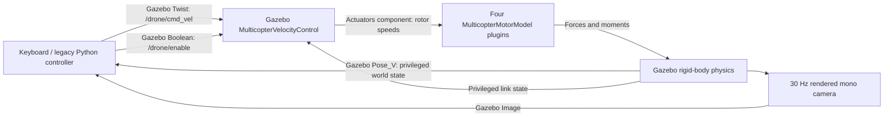

# Existing Gazebo/Python paths: audit, 25 September 2026

This is a source audit plus one bounded flight check. It preserves the earlier
project; it does **not** describe the ROS baseline as if it were the only system
that existed. Paths below are relative to the repository root unless stated
otherwise. Line references describe the files inspected in this session.

## What actually controls the earlier `drone` model

`run_px4_sim.sh` selects `px4_baylands_world.sdf`. Its default is Gazebo alone:
`--px4` is optional (lines 17–23, 106, 135–154). The word “PX4” in filenames and
the model's origin do not establish that the PX4 autopilot controls this drone.

The world merges `x500_mono_cam`, which merges `x500` and `mono_cam`.
`x500/model.sdf:7–74` supplies four motor plugins. The world adds
`MulticopterVelocityControl` at `px4_baylands_world.sdf:303–339` with namespace
`drone`, `cmd_vel`, `enable`, base link, velocity/attitude/angular-rate gains and
a 2 m/s² acceleration bound per axis. These inner loops remain active when
Python sends a velocity command. This is **not direct vehicle pose setting**.
The controller does use privileged simulator link state, rather than a PX4
state estimator.

The implementation writes a Gazebo `Actuators` **component** on the model. The
motor plugins prefer that component to their transport motor command input,
then calculate forces, moments and rotor response. Consequently, listing only
transport topics would miss a part of the control chain. The official Gazebo 8
[velocity controller source](https://raw.githubusercontent.com/gazebosim/gz-sim/gz-sim8/src/systems/multicopter_control/MulticopterVelocityControl.cc)
and [motor-model source](https://raw.githubusercontent.com/gazebosim/gz-sim/gz-sim8/src/systems/multicopter_motor_model/MulticopterMotorModel.cc)
establish this behavior. The velocity controller retains its last command;
there is no command-age watchdog in that implementation. A clean zero-command
shutdown and a process that crashes without doing so are different cases.

The local installed example
`/usr/share/gz/gz-sim8/worlds/multicopter_velocity_control.sdf:5` explicitly defines
the command as **body-frame linear velocity and yaw angular velocity**. For the
model convention used here, x is forward, y left, z up; values are m/s and
rad/s. World poses use Gazebo ENU coordinates in metres; positive yaw rotates
from world x towards world y. A body-z command is not exactly a world vertical
command when the vehicle tilts.

`run_px4_sim.sh --px4` separately runs `PX4_GZ_STANDALONE=1 make px4_sitl
gz_x500`; it does not set `PX4_GZ_MODEL_NAME=drone`. Binding that extra autopilot
to the already-defined `drone` was not established. Do not infer such a binding
from the script's banner. This option was not used for the audit flight.

## Topic and sensor contract

All names in this table are **Gazebo Transport**, not ROS topics. No ROS bridge
is required by the earlier Python controller/viewer path.

| Interface | Type and direction | Meaning / timing |
|---|---|---|
| `/world/px4_baylands_world/model/drone/link/camera_link/sensor/camera/image` | `gz.msgs.Image`, simulator → Python | Mono RGB, 1280 × 960, HFOV 1.74 rad, 30 Hz configured; sensor header contains simulation time. |
| `/world/px4_baylands_world/dynamic_pose/info` | `gz.msgs.Pose_V`, simulator → Python | World poses/quaternions. Privileged simulator truth; scripts extract drone xyz/yaw. No fixed publication rate assumed. |
| `/drone/cmd_vel` | `gz.msgs.Twist`, Python → simulator controller | Body linear velocity m/s; angular z is yaw rate rad/s. Project send loops target 20 Hz wall time. |
| `/drone/enable` | `gz.msgs.Boolean`, Python → simulator controller | Enable/disable the Gazebo controller; this is not PX4 arming. |
| `/model/drone/odometry` | Expected `gz.msgs.Odometry`, simulator → consumers | OdometryPublisher configured at 50 Hz; frame labels `drone/odom`, `drone`. Topic/type follows plugin defaults; not consumed by these root Python scripts and not sampled during this run. |

Camera geometry comes from
`PX4-Autopilot/Tools/simulation/gz/models/mono_cam/model.sdf:50–66`.
The actual camera is mounted at body `(0.12, 0.03, 0.242)` m with zero rotation
in `x500_mono_cam/model.sdf:7–14`. The separately drawn `cam_visual_link` in the
Baylands world is not the camera sensor and cannot be used to infer its optical
orientation. Pixel coordinates increase right/down. The image optical ray
convention used in the legacy math is forward/left/up body ray
`[1, -(u-cx)/fx, -(v-cy)/fy]`; some calculations omit camera translation and
vehicle roll/pitch.

The static `target_drone` at `(155, 152, 50)` m is included from `x500_base`
(`px4_baylands_world.sdf:233–239`). It was **not** present in the sampled
`dynamic_pose/info` stream. A world containing a target does not guarantee that
this particular stream provides its pose.

## Script map and execution order

These are available entry points, not claims that every file is currently
running. Only the simulator and the bounded audit probe were run in this audit.

### `run_px4_sim.sh`

- **Starts:** manual `bash run_px4_sim.sh`; optional `--viewer`, `--px4`.
- **Sequence:** parse flags → set world/model paths → source Humble if installed
  → start Gazebo → sleep four seconds → optionally start PX4 → optionally start
  viewer → wait for Gazebo. No topic messages or service requests are sent.
- **Configuration:** world/model/viewer paths at lines 17–20. No central config.
  It sources `/opt/ros/humble/setup.bash` while printing “Jazzy”.
- **Failure:** four-second sleep checks only process existence, not camera or
  command readiness; optional children are not supervised continuously. Cleanup
  signals stored immediate child PIDs, with no verified descendant handling.
- **Clock / truth:** wall-clock sleeps; no sensor timestamps or truth reads.
  `gz sim` lacks `-r`, so the user may need to press Play.

### `drone_keyboard_control.py`

- **Starts:** manually; not launched by `run_px4_sim.sh`.
- **Inputs:** terminal key events only. **Outputs:** `Twist` and `Boolean` above.
- **Sequence:** `main()` saves terminal settings → `CmdSender` background thread
  → `get_key_raw()` → map key to body velocity → `set_cmd()` → `_run()` calls
  `gz_pub_twist()` through one `gz topic` subprocess per publication.
- **Parameters:** `LINEAR_SPEED=2.0` m/s, `YAW_SPEED=1.2` rad/s,
  `SEND_HZ=20`, arm-key debounce 0.40 s (lines 38–45). A pause in key repeats
  replaces movement with zero. This is velocity teleoperation, not a position
  controller or visual algorithm.
- **Clock / failure:** wall-clock sleep for sender and monotonic key debounce;
  no sensor reads or timestamps, no ground truth. Clean exit sends zero and
  disable; subprocess publication failures are suppressed. Abrupt termination
  can leave the simulator's last command in effect.

### `px4_camera_fov_viewer.py`

- **Starts:** manually or `run_px4_sim.sh --viewer`.
- **Inputs:** Image and Pose_V table topics (fixed names at lines 38–39).
  **Outputs:** OpenCV window and optional `drone_cam_<timestamp>.png`; no control.
- **Sequence:** `run_viewer()` → `_try_native_transport()` → `CameraListener`
  and `PoseListener` → callbacks retain most recent frame/course → overlay and
  `cv2.waitKey(1)` loop. If bindings are unavailable it repeatedly uses
  `gz topic -e --json-output -n 1` and decodes base64.
- **Math / parameters:** quaternion-to-yaw for compass course; fixed image/FOV
  assumptions at lines 41–47. Heading is ground truth from Pose_V.
- **Clock / failure:** callback arrival FPS uses `time.monotonic()`; Gazebo
  header stamps are discarded. UI has no explicit fixed rate. A stopped camera
  can leave the last frame displayed as “ready”; stopping the viewer does not
  affect flight. Native path correctly retains Node references.

### `px4_ros2_bridge.py`

- **Starts:** manually; not launched by the root shell launcher.
- **Intended inputs:** Gazebo camera, `/imu` (`gz.msgs.IMU`), `/air_pressure`
  (`gz.msgs.FluidPressure`). **Intended outputs:** ROS `/drone/camera/image`
  (`sensor_msgs/msg/Image`), `/imu` (`sensor_msgs/msg/Imu`), `/air_pressure`
  (`sensor_msgs/msg/FluidPressure`). These are one-way observations, not commands.
- **Sequence:** `main()` requires `/opt/ros/jazzy/setup.bash` →
  `build_bridge_args()` → shell child `ros_gz_bridge parameter_bridge`.
- **Verified source problems:** camera input is configured for a different
  world/nesting at lines 39–43; `build_bridge_args()` ignores `gz_topic` and
  emits the ROS name as both names (lines 70–82); Jazzy is hardcoded despite
  this machine's Humble environment. Do not treat this bridge as verified.
- **Clock / failure:** event-driven bridge intended to carry sensor headers;
  no controller clock, conversions or truth processing here. If absent, the
  root Gazebo-native scripts still work. ROS observers lose those streams.

### `intercept_manual.py` — retained legacy, not a baseline

- **Starts:** manually; has `--world`, `--drone`, `--alt`, `--speed`, `--log`.
- **Inputs/outputs:** Image/Pose_V topics and Twist/Boolean command topics above,
  with world/model substitutions; OpenCV mouse/keys; optional `flight_log_*.csv`.
- **Source execution path:** `main()` → Gazebo topic-list polling →
  `build_transport()` → optional CSV → PID objects → enable keepalive → mouse
  callback → INIT/CLIMB/IDLE/MANUAL/TRACK loop. Control target is 20 Hz wall time;
  PID intervals use `time.time()`, pacing uses monotonic time. No image-age gate.
- **Verified blocker:** AST parsing reports `IndentationError` at line 646.
  It was not executed and was not repaired as part of this audit.
- **Algorithm honesty:** despite the Kalman/CSRT labels, lines 110–112 state
  that filtering/tracking was removed. `on_mouse()` stores a clicked pixel
  permanently (489–490); it is not updated from subsequent images. Thus it
  cannot demonstrate image-based target tracking in its current form.
- **Existing calculations:** pixel-to-angle and PID arithmetic; optional
  ground-plane intersection assumes world ground z=0 and yaw-only attitude,
  using privileged drone pose. That calculation is only a logged estimate,
  not a valid range sensor for a general airborne target. It is not evidence of
  an implementation of either supplied paper.
- **Failure / truth:** cached image and privileged drone pose can remain stale;
  native subscription Nodes are local variables rather than retained members
  (lines 177, 192), another unverified lifecycle concern. Normal cleanup intends
  zero/disable. Existing CSV records commands/errors, but not measurement age.

### `kamikaze_intercept.py` — retained legacy, not visual-only

- **Starts:** manually; world/drone/target/altitude/speed CLI at lines 50–62.
- **Inputs/outputs:** same configurable Image/Pose_V and Twist/Boolean interfaces;
  Pose_V tries to read both vehicle and target; OpenCV display and console log.
- **Sequence in source:** transport → PIDs/`TargetTracker` → enable keepalive →
  state machine. `detect_target()` uses thresholded image blobs and spatial
  rejection; `pixel_to_angle()` computes angular image offset, followed by PID
  arithmetic. This is not a demonstrated paper-controller implementation.
- **Frames / timing:** image offsets are in **degrees** here, unlike the radians
  used in the manual script; command output units remain m/s and rad/s. Main
  loop aims at 20 Hz wall time; PID/state-machine timers use `time.time()`;
  pacing uses monotonic time. Transport drops sensor timestamps and returns
  copies of the latest cached frame, allowing repeated/stale-frame processing.
- **Truth and assumptions:** altitude/yaw use simulator drone truth; initial
  heading uses hardcoded target spawn; target truth is consulted in terminal
  behavior (1049–1085). This cannot be labelled visual-only. The static target
  did not arrive on its chosen pose stream in the audit run.
- **Unvalidated source inconsistencies:** yaw-command sign differs between
  approach/tracking/lost-target branches. Several constants are labels or
  unused remnants. No collision/approach/tracking claim was reproduced; no
  interception behavior was run or modified in this session.
- **Failure:** cached frames/poses lack a freshness watchdog. Detection-loss
  logic does not detect a frozen image stream if the cached image still yields
  a blob. Normal cleanup intends zero/disable; process death can retain command.

### `plot_flight_log.py`

- **Starts:** manually with a CSV path, or searches root `flight_log_*.csv`.
- **Sequence:** `main()` → `load_csv()` → `to_float()` → plots → saves PNG and
  opens a Matplotlib window. No topics/services, no simulator control.
- **Inputs:** `t`, angular errors/PID terms, `az`, `vz`, vehicle xyz/heading,
  and optional ground-plane target estimate; missing values become NaN.
- **Units/clock:** plots logged relative seconds, degrees, rad/s and m/s;
  it inherits the input clock and cannot verify sensor latency or truth origin.
- **Evidence limit:** `flight_log_20260702_105611.csv` contains `src=CSRT`, while
  the present manual script has no active CSRT tracker and does not parse.
  That historical CSV therefore cannot establish reproducibility of the
  current checked-in code. It is preserved, not overwritten.

## Other worlds and related folders

| File/folder | Classification and evidence |
|---|---|
| `px4_drone_world.sdf` | Alternative root world, also x500 camera + Gazebo velocity controller (344–402); static synthetic red target. Includes `model://vrc_heightmap_1`; resource availability not verified. Not launched in this audit. |
| `px4_baylands_world.sdf` | Existing launcher default. Physics step 0.004 s; remote Fuel URIs were satisfied by local cache in this test; track mesh has an absolute machine-specific path. Not portable without those resources. |
| `worlds/playground.sdf` | Standalone introductory rigid-body scene, not a drone experiment; preserves unrelated work. |
| `test.sdf` | Older SDF 1.4 world with model references and a commented ROS interface plugin. No active connection to root launcher or ROS baseline was found. |
| `P_Nav/PN_simulation_2D.py`, `PN_simulation_3D.py` | Standalone Matplotlib point-mass demonstrations: click/slider waypoints → exact simulated target state → kinematic update → animation. No Gazebo, ROS, PX4, camera or vehicle actuator interface. Numerical step 0.05 s, animation interval 30 ms; these are separate clocks. Ideal constant-speed state, no multirotor dynamics. They are not image-based controller validations. |
| `Dhanur_New/` | Separate RTSP/custom-UDP/SIYI application, not a Gazebo or ROS node set. See below. |

`Dhanur_New/main.py:71–78` launches `utils.tracker.Tracker`. That imports and
coordinates UDP receiver/processor, stream receiver/processor/renderer/writer,
vehicle controller and SIYI gimbal components. `streams/` handles RTSP frames,
detection, drawing and recording. `communication/` handles binary datagrams;
`structures/` declares their layouts. `utils/calculations.py` supplies pixel
angles and PID arithmetic; `gimbal_control_siyi/` encodes vendor UDP commands;
`testing/` contains synthetic message senders. These are related reference
components, **not dependencies of the Gazebo root scripts**, even where comments
say arithmetic was adapted from them.

`utils/control_vehicle.py:34–43,78–147` consumes a command queue and sends custom
UDP movement/course messages and SIYI commands. `constants.py` contains RTSP and
private-network endpoints. No receiver implementation was identified here that
proves those movement packets ultimately reach PX4, another flight stack or a
Gazebo model. Their downstream semantics remain unknown. `constants.py:127`
also contains a bare `C` expression, a source-level import blocker if undefined.
No hardware/network-control application or test sender in this folder was run.

## Reproduced behavior and exact limits

Run directory:
`runs/audit-legacy/20260925_113620/` at repository root.

- `config.json`: exact world SHA-256, command, resource path, unique
  `GZ_PARTITION` and experiment description.
- `audit_probe.py`: exact temporary test harness preserved with the result.
- `gazebo.log`: component console output; `camera_first.png`: first RGB image.
- `measurements.csv`: wall elapsed time, simulation pose/image timestamps,
  received frame count, body-z command, simulator xyz and quaternion.
- `summary.json`: measured results and limitations.

The probe used system Python with `PYTHONNOUSERSITE=1`, Gazebo **8.11.0**, the
existing world/models, server-only `-s -r --headless-rendering`, and its own
transport partition. It waited for camera frames and drone pose, sent only a
bounded **0.4 m/s body-z climb for three simulation seconds**, then **zero
velocity for five seconds**, and stopped its own Gazebo process group. No PX4,
ROS, viewer or legacy interception script was needed. It had a 3 m altitude
bound and a three-wall-second pose-staleness guard. The simulator exited 0.

Measured evidence:

| Observation | Result |
|---|---|
| Camera callbacks | 247; 1280 × 960 RGB frame rendered and inspected |
| First/last image simulation stamps | 0.008 / 8.120 s |
| Image stamp ordering / effective rate | Monotonic; approximately 30.30 images per simulation second |
| Final altitude | 1.2843 m |
| Last two simulation seconds altitude | 1.2795–1.2843 m |
| Last two simulation seconds horizontal drift | 0.3843 m |
| Target present on dynamic pose stream | No |
| Flight-check wall time after readiness | 11.15 s |

This verifies that the earlier Gazebo physics/controller/camera path **does
work for a basic climb and near-constant altitude**. It does not establish
stable position hover, image tracking, moving-target tracking or stand-off
approach. The horizontal drift is material and remains documented.

The log reports a missing optional `MotorFailurePlugin`, unsupported Ogre
materials and repeated triangle-mesh contact warnings. Tree materials rendered
black in the inspected image. These did not prevent this basic check, but they
affect a trustworthy visual-scene/dynamics baseline. No dependency upgrades or
world edits were made to hide them.

An earlier sandbox attempt in `runs/audit-legacy/20260925_113604/` failed with
`getifaddrs`; it is not a simulator-method failure. The successful check used
approved local networking access. It did not send commands outside its private
Gazebo partition.

## Implication for architecture choice

Keeping the root Gazebo/Python transport is a viable teaching path for basic
simulated velocity control; it demonstrably does not require `px4_msgs`.
However, these old tracking entry points are not a repeatable research
baseline, and the plugin's simulator-state inner loops must be disclosed.
The separate `drone_ws` ROS/PX4 path should be assessed on its own existing
infrastructure. Reducing the number of terminals is a launcher concern, not a
reason to erase either architecture.

For either path, a velocity-command demonstration retains an inner velocity
controller. It cannot be described as a faithful angular-velocity-and-thrust
implementation of the second paper. No such rewrite was attempted in this
audit. The active baseline and the requested monocular sensing change are
documented in the main package architecture guide.
